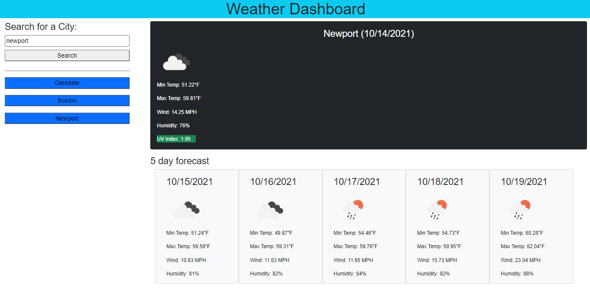

# Weather Application

## Project Description
    This project was created using JavaScript, HMTL, Bootstrap and CSS. When the page first loads you are presented with an option to search for a city. Once a city is searched it will be added to localStorage for easier access. The UV index changes colors based on the severity that day. 

## Production Link
[website](https://blitman12.github.io/Weather-Application/)

## Screenshot

## License
 JavaScript, Code Logic and Styling
* © 2021 Bradley Litman 
